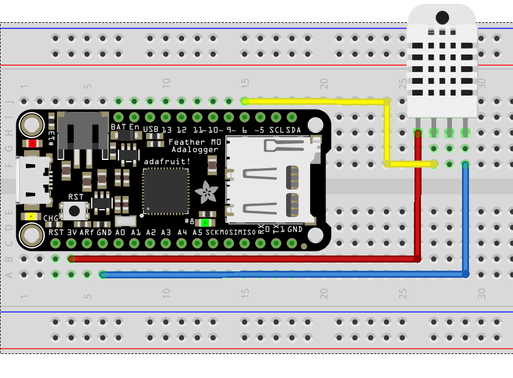
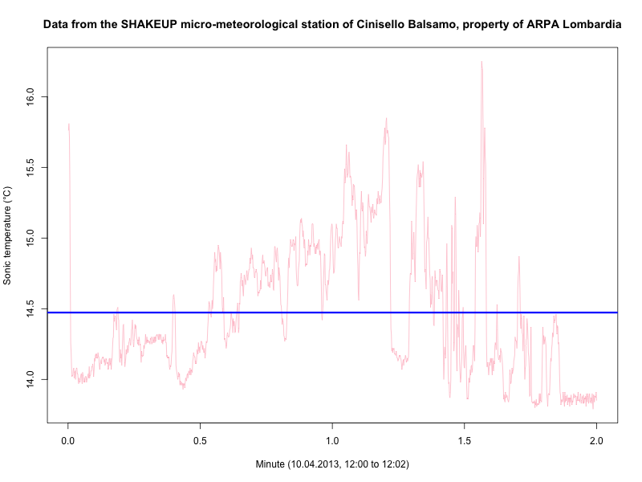

## A very simple mission...

The first system in this tutorial series is a tiny device which gathers readings of dry bulb (i.e. "usual") temperature and relative humidity, and prints them to an Arduino terminal session.

This is simple, sure. But sufficient to grasp something of the overall sensor operation and its readings dynamics - two things one should be interested in, if their task is to build a data logger.

Temperature and relative humidity in addition are something we all are familiar to (we'll see shortly how "familiar" does not necessarily mean "knowing"), and this may make understanding by laypeople easier, in the sense we, the engineers, have much less to explain them for them to be confident about what they see on screen once the system works.

## …and a correspondingly simple system

Presenting a temperature and a relative humidity on a serial terminal demands an Arduino, and a temperature and relative humidity sensor. The following diagram illustrates how these two are connected (easy task: only 3 wires are required).



The sketch accomplishing the task we want being made is almost as simple as the two lines I used to describe it. That's no more than this:

```
// Simple data reader.
//
// This Arduino sketch is part of the Hypatia project.
//
// Parts:
//
// - An Arduino (an "Uno" is just sufficient;
//   I'm using a Feather M0 AdaLogger, by AdaFruit)
// - A DHT-22 temperature and relative humidity sensor
//   (good for indoor, mainstream accuracy)
// - A breadboard
//
// Libraries (if you have not yet installed):
//
// - DHT sensor library (from AdaFruit)
// - Adafruit Unified Sensor library (it may be necessary to install
//   this dependency of DHT lib by hand).
//
// What you may expect from this sketch:
//
// 1) A very very simple data acquisition example
// 2) Indirectly, a test that your DHT-22 and 
//
// This is open-source software, covered by the MIT license.
//
//
// Written by: Mauri Favaron

// Library imports:
#include <DHT.h>    // DHT-11, DHT-22 temp/relh sensors

// Global variable, referring to the DHT-22 used in this project
#define DHT_PIN 6             // The pin we'll use to "speak" with the DHT-22
#define DHT_TYPE DHT22        // Library "DHT" wants it...
DHT dht(DHT_PIN, DHT_TYPE);   // Object corresponding, in software, to the DHT sensor

// Global variables, containing the values of temperature and
// relative humidity just as coming from the DHT-22 sensor
float rTemperature;  // °C
float rRelHumidity;  // %

// Initialization
void setup() {
  Serial.begin(9600); // Will be used to monitor the system activity
  dht.begin();        // Clean-up and start DHT-22
}

void loop() {

  // Wait some time (the amount should be larger than the interval
  // the slowest sensor takes to get a new reading; 1s is sufficient
  // for the DHT-22.
  delay(1000);

  // Get readings from the DHT
  rTemperature = dht.readTemperature();
  rRelHumidity = dht.readHumidity();

  // Show us what the sensor did read
  Serial.print("Ta: ");
  Serial.print(rTemperature);
  Serial.print(" °C    RH: ");
  Serial.print(rRelHumidity);
  Serial.println(" %");
  
}

```

As you can see, the sketch (that is, the "program" as it is known in Arduino lingo) is really short. Most of it, especially on the beginning, is made of (useful) comments. But the real stuff is quite tiny, reflecting the small amount of things our temperature and humidity reader has to do: get two instrument readings, and print them to the USB-emulated serial line of Arduino.

## Some reflections

### Simple code, and the complexity lurking behind of it
#### Something we could understand...

As easy the code is, some little things may be worth mentioning about it nevertheless.

First, the dialog between the Arduino and the DHT-22, our thermo-hygrometer, occurs entirely within cute library function calls. This relieves us from many micro-decisions (for example about how to interpret the DHT-22 protocol - the sensor has a digital interface), and we can be grateful to whom has written them.

But on the other side all this information hiding, perfectly in line with the tenets of object-oriented programming, deprives us, and eventually our "customers", of any knowledge about the actual mechanisms implemented in the call.

Is this relevant? Well, it depends. In some use cases, just knowing a rough approximation of the temperature and humidity is sufficient - think for example to a household digital thermometer. In others (say for example a biomedical device, or a meteorological sensor), the demand for accuracy is higher and some detail on how the readings were formed become important.

Just to mention some of the possible questions:

- Are the readings just one-shot analog-to-digital conversions? Or, rather, are they averages?
- If they are averages, how many one-shot readings were used to form them? Sampled at which rate? Did all one-shot readings entered the average, or some of them have been excluded based on some plausibility check?
- In all cases, did a filter intervene?

And of course many, many more.

#### …and something we can not

Unfortunately, if we just reflect on this a little we find we have a big trouble: we may _not_ be able to find an answer, even if the DHT support library is open source!

In my experience, this unlovely fact has two major causes:

- The library code may be fully open source and wonderfully documented, but the details of its implementation may be really nasty, to the point following it could not be that easy. The bit-banging kind of protocol used to make the Arduino talk with the DHT-22 is something not trivial, all timings-and-rises-and-falls, and all the library contents deals with it. (For completeness, the library itself is composed by few very small programs; the C++ source containing the functional code is "just" a 250 code lines, with many comments).
- And, what the library does (allowing DHT-22 and Arduino to talk to each other) has _nothing_ to do with the essence of our questions. The final answer would come from the detailed knowledge of the internals of DHT-22 design and manufacturing, at a granularity which is decidedly much finer than what is really available in the sensor data sheet.

Sure the DHT-22's low cost is fine for us, as we'll be delighted in experimenting, but carries with itself a load of secretiveness about sensor innards which makes understanding more difficult, if not impossible at all.

#### Ethics and empathy, in engineering, are important

In the very end, the complete lack of detailed information about the measurement process prevents us to find sensible answers to my simple questions. And this means we, the engineers, by choosing to use the DHT-22 actually endorsed it. I really do not feel a member of some "directing social class", but in my designs I may end up to impose on unwilling creatures (clients, users of my devices, other people, animals and plants) restrictions and boundaries they are completely unaware of, despite the impact they may have on their lives.

(This to say, deciding to win oneself bread as an engineer is not just a "job", but a _big_ responsibility, with many and broad ethical implications; as the IEEE Women In Engineering motto says, "I'm an engineer, I change the World": let's make all possible for this change to be for a better planet and life, but let's also be wary it may be for the worse. In my opinion and experience, being an engineer is not ideal for nerdy people detached from others; quite on the contrary, it is a very people-oriented thing, even if you happen to design small invisible and unobtrusive embedded systems.)

A second thing to say about the code is, values coming from the DHT-22 are believed blindly. And this, too, may not be a good thing.

Some lines from an output coming right from my own built may help clarifying this point.

```
Ta: 23.50 °C    RH: 54.00 %
Ta: 23.50 °C    RH: 53.90 %
Ta: 23.50 °C    RH: 53.90 %
Ta: 23.60 °C    RH: 54.00 %
Ta: 23.60 °C    RH: 54.00 %
```

Numbers have 2 figures past the decimal point. But the second of these is always zero: the actual resolution is 0.1 °C for temperature and 0.1 % for relative humidity.

This is confirmed by the DHT-22 data sheet, where the manufacturer (Aosong Electronics Co., Ltd) confirms the resolution inferred by the data.

The same data sheet tells another important thing: the sensor _accuracy_, equal to 2% for relative humidity, and 0.5 °C for temperature.

This practically means the numbers for temperature and relative humidity have _zero_ (that is, positively none) significant digits: the one we see due to sensor resolution is more illusion than truth - a marketing hype rather than real physics?

To be entirely fair, I can say sensors with better accuracy figures do exist, but either they cost almost six-seven times more than a DHT-22, or demand users to build conditioning circuitry (a task simple in theory, but requiring surprisingly tricky attentions - think for example to a novice-built Wheatstone bridge using low-quality resistors on a breadboard). The DHT-22 positions as a fairly typical sensor for domestic, non-critical applications, like e.g. the wall thermometer. Controlling an oven would be maybe just a bit too much for our beloved DHT-22...

(That a resolution finer than accuracy is not a marketing hype we'll see soon, in the next section.)

## A _very_ wrong device? Glimpses from the real world

### Three practical questions

Our data reader is just a starter, a tangible demonstration that building a digital thermometer is possible using an Arduino (or an alike platform) and a low-cost temperature and relative humidity sensor.

But, how far are we from a data "logger"?

What the numbers collected say to us on the actual temperature and relative humidity?

To what extent is this precious information changed because of the way we "measured" it?

The first question has a very simple answer: the data _reader_ is quite far from a data _logger_. The latter does not limit its functionality to just show measurement values: rather, it should _record_ the data just read to a permanent memory (the Feather 32 M0 Adalogger offers the advantage of a MicroSD slot) in a form simple and documented enough to ensure other people can use it.

The second question, about the relation between the real temperature and relative humidity and the numbers we claim being their "observed values" devise a close scrutiny, because it is far from obvious.

And the third, too, as vague as it seems, may be answered to some extent once we figured out what to say about the second.

### Temperature, beyond how we imagine it

#### Temperature, as it is observed through a fast sensor

Before to start, a warning: we deal with temperature, but considerations about relative humidity are pretty much the same.

And now, the story.

If we ask a person taken at random what temperature is, her most likely answer will be "The number I can see on the thermometer display."

This answer is wrong, of course - the _real_ air temperature is a macroscopic quantity connected to the thermodynamical state of the place we're interested to, and finds a precise definition in terms of mean molecular speed, a statistical mechanics concept: the thermometer reading is an observation of it, hopefully accurate. A temperature observation is analogous, in this respect, to the menu, temperature being the fine gourmet speciality described by it. Or, assuming quite a cynical standpoint, temperature observations are to real temperature just what campaign promises are to actual policies after the election has been won.

Insisting on this line of thought would lead us to investigate the difference between real temperature and the numbers representing it. We would rightly speak of accuracy and precision, maybe even debate on some subtleties related to their definitions...

And doing this could maybe mislead us to imagine, as the layperson we met before, that temperature (the real one, not its observations) is something objective and simple, whose value may be easily measured by the instrument we have at hand. As readings from common-use thermometers vary slowly and smoothly we could be induced to imagine the same must happen to the real temperature itself.

In short, we would find quickly find us comparing temperature readings not to real temperatures, but to our mental image of them - an image created by the design properties of the instrument we are used to employ to measure their value.

And _this_, my dear, is temperature, as observed using a three-dimensional ultrasonic anemometer (which also works as a fast-sampling precision thermometer):



The blue line superposed to the measurements plot represent the two-minute average, something similar to what one could get from an "ideal" conventional thermometer.

The temperature changes we see in the pink line of these two minutes are genuine. A micro-meteorologist's eye would easily detect familiar rising ramps and quick falls; what looks impressive to me is that massive changes may be occur within few tenths of a second.

A regular thermometer would not be able to follow such a quick variation (more on the subject a bit later). Even our sensitive skin does not allow acknowledging the nervous changes of temperature when thermal convection is fully developed. And the ultrasonic anemometer-thermometer, with a maximum sampling rate in the order of 100 Hz, can only grasp a part of it: the graph of the function expressing air temperature at a specific time instant and at a point is in any likelihood a fractal, and sampling it at a finite (in fact slow) rate yields a "curve" whose simplest mathematical description is as an outcome of a random process...

#### The conventional thermometer as a _first-order instrument_

OK, but… Our household thermometer doesn not show a churning value following the minute (or large) variations of "real" temperature: it does vary, but slowly enough for us to see "the" temperature at some defined instant, and to imagine the value of temperature reported by the same thermometer in the next two minutes will not be so different from the current one. We _love_ to imagine temperature to be a _continuously differentiable_ function of time and position. Why this?

As I mentioned brieflt in the beginning of this section, mainly because the existing thermometers report a slowly and continuously changing outcome.

In fact, these "existing" thermometers fall in a small set of possible categories (we limit attention to sensors providing an _electrical_ output, which a conventional data logger can read easily). They may be variable resistors, like for example the long platinum wires coiled in a packed assembly known as Pt-100; or, it may be a semiconductor-based thermistor (with an interesting variant, that of "linear" thermistors, which in fact are regular thermistors read and processed by a microscopic micro-controller); or even, they may be variable voltage generators, as thermocouples for instance.

Whatever their physical operating principle, these sensors act as _primary transducers_ mapping the real (fractal) temperature to a (smooth) electrical signal the data logger will then convert to a temperature reading.

The nature of these primary transducers is such that the smoothness of their output is proportional to their thermal inertia: the larger the sensor size, the slower it will react to the naturally occurring temperature changes.

This fact may be expressed more precisely, by observing that a thermometer response is very well approximated by a first-order linear ordinary differential equation.

That is, the usual thermometers behave as _first-order instruments_.

The response of a first-order thermometer to a step change in temperature can be seen in the following plot, along with an interesting event.


Here you see the temperature reading adapting to the final temperature with a smooth rise, in fact along a negative-exponential path.

Conventionally, when the adapting reading reaches a value within $$\frac{1}{e} \approx 0.368$$  of the final temperature, as engineers we declare ourselves happy and say the final temperature "has been reached". The time from the step beginning and the "final temperature reached" event is called _response time_. Its value, for ordinary thermometers, may be of some tens of seconds, the larger the thermometer sensing device and the thermal inertia of the materials it is built from, the longer the response time.

You may feel this kind of behaviour is a bit contrived, and it really is if we compare the neat step function to the real temperature we've seen already.

But a similar temperature change is what thermometers are subject to during the tests they are subject to after manufacturing.

Incidentally, very seldom do the technical specification of ordinary, household-grade thermometers report their response time, even though it is relatively easy to measure. This is not that a pity however: with a bit of imagination everyone can build an ersatz temperature step change chamber, and then get a rough estimate of the thermometer response time, would it be necessary.

### The conventional thermometer: a low pass filter!

#### What a conventional thermometer measures, really?

As we have just seen, due to their finite (and slow) response time conventional thermometers cannot sense turbulent fluctuations. What they do, however, is to approximate the "mean" temperature, and they do it well.

In order to place things a bit in perspective, let's consider _Reynolds decomposition_. Osborne Reynolds was a physicist and fluid-dynamicist active in nineteenth century. He's renown for his studies of turbulence, and his name is connected forever to the all-important Reynolds Number, whose increasing value accompanies the transition from laminar to turbulent flow.

The now-called Reynolds decomposition, less celebrated, is also a consequence of his pioneering experiments, and indeed very interesting in itself. Stated the most generic way, it says that if $$x$$ represents a signal measured within a turbulent flow (temperature, to stay with our case), then we may write
$$
x = \overline{x} + x'
$$
where $$\overline{x}$$ represents the "mean part", and $$x'$$ the "turbulent fluctuation".

In understanding the formula above and its consequences it is important to hold in mind that all symbols, $$x$$, $$\overline{x}$$ and $$x'$$, are functions of time, and that the "mean part" $$\overline{x}$$ is to be intended the ensemble average of a large number of experiments, made by assigning (ideally) the same and identical initial and boundary conditions, something professor Reynolds was at ease with, using his carefully crafted pipe experimental bench.

That a physical quantity measurable within a turbulent flow was separable in a "mean" and a "fluctuation" part was not a new idea in Reynold's times: the first intuition of this hypothesis originated during the Renaissance, thanks to the ubiquitous genius of Leonardo da Vinci, who first noticed that a turbulent flow in channels occurred as _en masse_ superposed to irregularly interfering vortices, waves and many other motions which taken together gave the impression of extremely irregular fluctuations. The big merit of Osborne Reynolds was to make the intuition of Leonardo an experimentally proven fact.

The use of ensemble averages in the decomposition definition, however, demands a laboratory in which an experimenter can set conditions at will and repeat any experiment, given time and money enough. The Nature is not a laboratory, however, and this may make our life miserable as micro-meteorologists and environmental fluid-dynamicists, unless we make some assumptions.

You may find these assumptions in one of the many excellent books dealing with micro-meteorology (a simple one is [Arya, 2001]). Here we'll have a look to the biggest: the observations taken on field (or within your home) using an instrument, and dealing with a quantity sampled within a fluid in turbulent motion, can be assimilated to an outcome of a stationary, ergodic random process.

Of course the fluid motion occurring at macroscopic scale has nothing random, but thanks to the vagaries induced by turbulence it resemble randomness quite much. So, philosophically speaking the ergodic process assumption is wrong, but for us, pragmatic engineers, it may be accurate enough.

The word "ergodic" is key. In short, the statistical properties of a stationary ergodic process (mean, variance and covariances among them) do not change with time, and can be estimated at acceptable accuracy level from a long enough realization of the process.

Stationarity, in Nature, can only be guaranteed "locally" with respect to time (think, for temperature, to the huge variation you may experience within minutes since the inception of a Foehn episode; or, on a longer observation scale, to the cyclical changes occurring daily and seasonally). That it, it makes sense to partition a single natural time series in many sub-series each being stationary in the weak sense up to order 2. The question remains, whether any of these order-2 stationary sub-series is "long enough" to allow a reliable estimation of the moments and other statistics. Pragmatically, practitioners assume any series is almost stationary, and the little non-stationarity you may find can be removed by a bit of data cleaning ("detrending" and "despiking"). We practitioners know very well this is not _true_, strictly speaking; the error we commit was never in the history of micro-meteorology found unacceptably high, however. And so, we feel authorized to sleep quietly on our nights.

Staying practical, if we accept measurements under turbulent motion regimes are "ergodic", then we may be confident that we _can_ approximate the Reynolds' ensemble means with _time averages_.

Now: what is a "time average"? The answer may seem obvious: if we have $$n$$ measurements, arranged in a finite time series $$\left\lbrace x_{i} \right\rbrace_{i=1}^{n}$$ then the mean is
$$
\overline{x}=\frac{1}{n}\sum_{i=1}^{n} x_{i}
$$
(to be fussy to the bone, the arithmetic mean so defined is a single number, and not a function of time as it should be: a more proper definition would be the mean is, in this case, a sequence $$\left \lbrace \overline{x}_{i} \right \rbrace_{i=1}^{n}$$ with $$\overline{x}_{i}=\overline{x}$$, as defined by the preceding formula).

Other definitions of the term "mean" are possible, however. Like this, for example:
$$
\overline{x}=\frac{1}{n}\left( \sum_{i=1}^{n} x_{i}^{p} \right)^{\frac{1}{p}}
$$
Or this:
$$
\overline{x}=\sqrt[n]{\prod_{i=1}^{n}x_{i}}
$$
Or the back-transform of the Fourier transform cut to a specified frequency. Or the effect of a filter in the time domain. Or...

The _effect of a filter in the time domain_. This is what a thermometer, as a first order instrument, yields to a datalogger when the latter gets a reading.

A simple conceptual model of an ordinary thermometer is the discrete counterpart of a first order differential equation, namely a recursion like this
$$
\overline{T}_{i}=\beta T_{i} + \left(1-\beta\right) \overline{T}_{i-1}
$$
subject to an initial condition like for example
$$
\overline{T}_{0}=T_{0}
$$
where $$0 \le \beta \le 1$$ is the filter parameter (related to the filter - the thermometer - response time).

Of course, if $$\beta$$ is larger than 0 and smaller than 1, then the filter output (the thermometer readings) will carry information from both the real signal (temperature) _and_ the past response (readings), mixed together. 

In practice, the thermometer will provide a smoothed-out response from a "turbulent" input. A "mean", so. With a distinctive character depending on the specific value of $$\beta$$, which in principle may be determined during the instrument development.

Said differently: the thermometer acts on real temperature as a low-pass filter.

A low-pass filter having an intrinsically analog nature, with a response function not as brutal as the back-Fourier-transform of cutted signal frequency, and whose sharpness is _an intentional design parameter_.

#### Accuracy, revisited

If the common thermometer is an analog low pass filter, then we may say its readings are given according to an operational definition of "mean", which is _the thermometer itself_. Different models, equal different means measured.

Do these "means" have to do with professor Reynolds' ensemble averages? Well, not exactly, and the answer is quite mathematical (although simple).

Ensemble averages possess some properties, which may be expressed mathematically, and which are collectively known (among micro-meteorologists) as Reynolds Postulates. There they are (written my way):

1. $$\overline{\overline{x}} = \overline{x}$$ (involutory character)
2. $$\overline{x \overline{y}} = \overline{x} \overline{y}$$
3. $$\overline{a x + b y} = a \overline{x} + b \overline{y}$$ (linearity, if $$a,b$$ are scalars).

Well, a first-order filter like a thermometer fails to fulfil the involutory property. That is, would thermometer readings (filter output) be routed to another filter with the same properties as the thermometer, then the result would _differ_ from the readings: the former would be smoother.

But, assuming no one would ever try to build such a second-level filter and retrofit it to a thermometer, this failure remains purely theoretical, without serious practical consequences.

An interesting thing about all "mean" operators we have seen is, they yield the same identical value if fed with a constant external temperature.

Circumscribing an environment where temperature may be considered constant is not simple, but posible - for example using a good quality climatic chamber. These environments are in fact used when assessing the accuracy of a thermometer, comparing its readings to a reference instrument.

The accuracy, then, is measured on a suitable sample of production specimens _under constant, zero-fluctuation, conditions_. After a bit of time, the thermometer manufacturer feels confident enough, and happily declares the accuracy to be, say, the 2%. Or, say, $$\pm 1$$K.

But, is this "ideal" figure totally informative of the real field accuracy? May field and laboratory accuracies _differ_?

Maybe...

Sure this is not a thing one would lose ther sleep about. Yet, it's worth some reflections, maybe even investigation.

It is also possible a unique answer does not exist, with many partial answers for each of the technologies used. Especially to date, when new design thermometers are beginning to find their way into mainstream applications (a noteworthy example is the capacitive thermometer, opposed to the more common and customary resistive thermometer).

# References

| Short reference | Full reference data                                          |
| --------------- | ------------------------------------------------------------ |
| Arya, 2001      | S.Pal Arya, _Introduction to Micrometeorology_, 2nd ed., Academic Press, 2001 |


